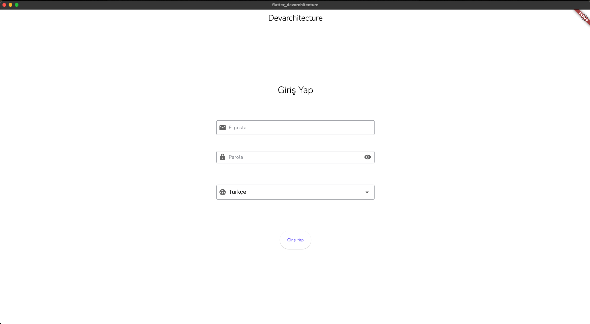

# Login Screen and Main Page

This document provides information about the login screen, language selection, and the main page after successful login.

## Login Screen

The login screen is the entry point of the application. It contains the following elements:

1. Username/Email field
2. Password field
3. Language selection dropdown
4. Login button

### Login Credentials

To access the application, use the following credentials:

- Username: <admin@adminmail.com>
- Password: Q1w212*_*

## Language Selection

Below the password field, there is a dropdown menu for language selection. This allows users to choose their preferred language for the application interface.

Available languages may include:

- English
- Turkish
- Other supported languages

## Main Page

After successful login, users are directed to the main page of the application. This page typically includes:

1. Navigation menu
2. Dashboard or overview of key information
3. Quick access to main features
4. User profile or settings

Note: The actual layout and features of the main page may vary depending on the user's role and permissions.

## Login Process

1. Enter the username (<admin@adminmail.com>) in the username/email field.
2. Enter the password (Q1w212*_*) in the password field.
3. Select your preferred language from the dropdown menu.
4. Click the login button.
5. If the credentials are correct, you will be redirected to the main page.

If you encounter any issues during the login process, please contact the system administrator or refer to the troubleshooting section in the user manual.
